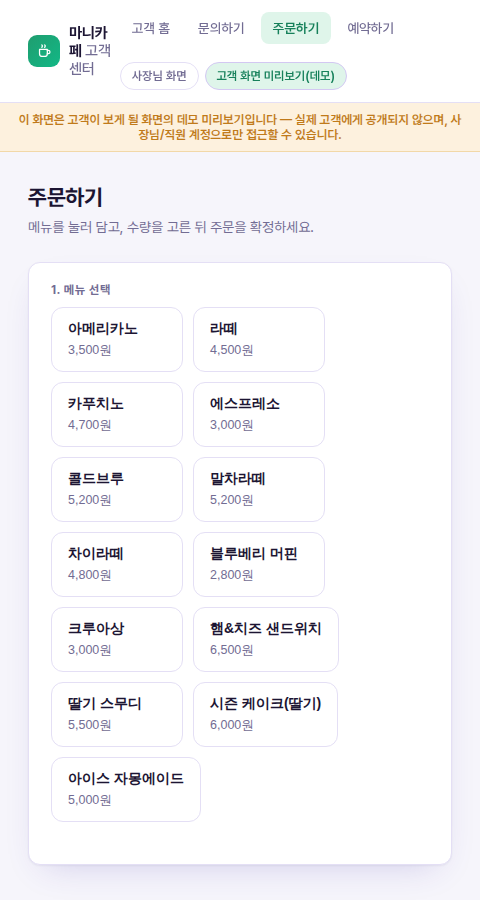
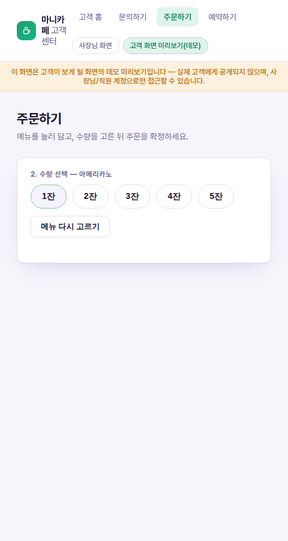
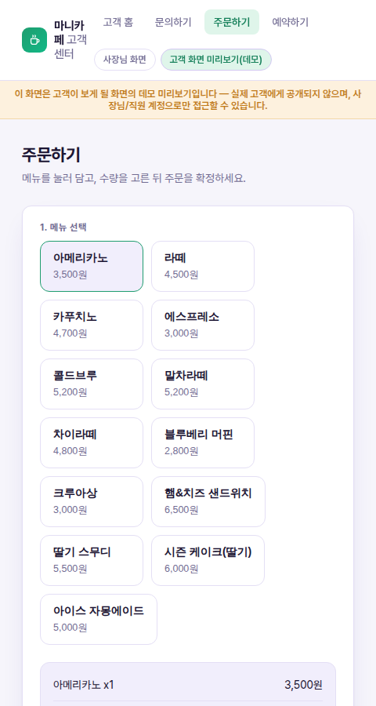
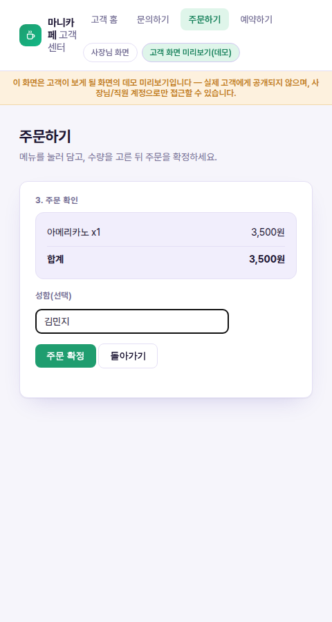
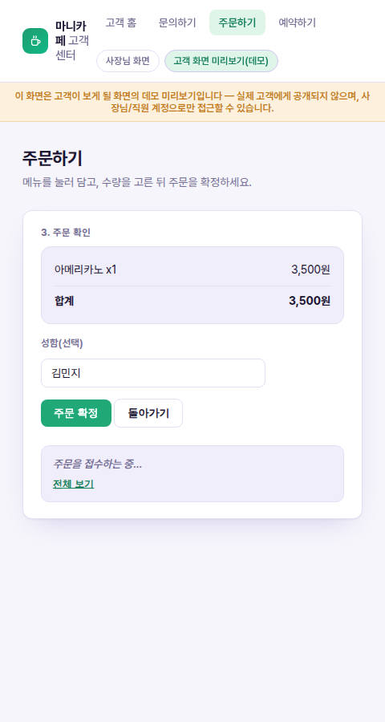
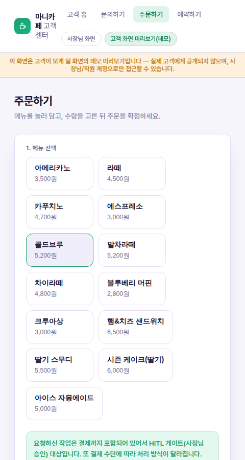
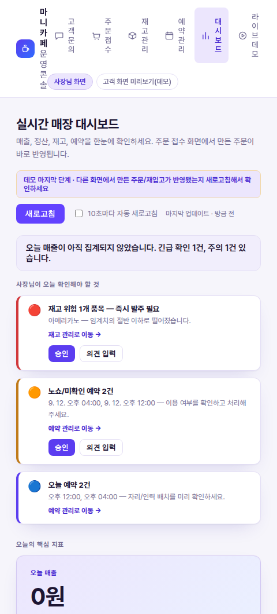

# 마니카페 2화면 스토리보드 — "손님이 주문하면 사장님 화면엔 무엇이 뜨나"

**[260912_마니카페_사장님의_하루_2화면시나리오.md](260912_마니카페_사장님의_하루_2화면시나리오.md)의 12:00 점심 피크(주문·결제) 접점을, 실제로 두 개의 webapp 화면을 나란히 띄워놓고 클릭만으로 재현한 스토리보드입니다.** 아래 스크린샷은 전부 각본이 아니라 `webapp`을 로컬에서 직접 띄우고 Playwright로 클릭해 얻은 실제 화면입니다 — coordinator 응답도 실제 Hermes 에이전트가 생성한 문장입니다.

> 후속: 이 문서의 "한 줄 채팅 + 주문확인 버튼" 형식을 실제 `/customer` 고객 화면에 구현한 스토리보드 — [260912_마니카페_고객화면_한줄주문위젯.md](260912_마니카페_고객화면_한줄주문위젯.md)

## 준비물 — 두 개의 브라우저 창

| 창 | 화면 | URL |
|---|---|---|
| **왼쪽 — 손님용 화면** | 손님이 보는 셀프 주문 화면 | `/customer/order` |
| **오른쪽 — 매장 대시보드** | 사장님이 보는 실시간 대시보드 | `/dashboard` |

두 화면 모두 같은 로그인(사장님/직원 계정) 뒤에 있습니다 — `/customer/*`는 실제 손님에게 공개된 별도 사이트가 아니라 "손님이라면 이렇게 보일 것"을 같은 콘솔 안에서 미리 보여주는 데모 전용 화면입니다(화면 상단 배너로 항상 표시됩니다).

> ⚠️ **실행 전 참고**: `/customer/order`, `/customer/faq`, `/customer/reservation` 화면은 이 저장소에 아직 커밋되지 않은 작업 중인 화면입니다(`git status`에 `??`로 표시). 지금 배포되어 있는 `http://localhost:19131` 컨테이너에는 반영되어 있지 않을 수 있습니다 — 재현하려면 `webapp/` 소스를 그대로 두고 로컬에서 `uvicorn webapp_bff.main:app --port 8090` 등으로 띄우거나, 커밋 후 컨테이너를 다시 빌드해야 합니다(`docker compose build webapp && docker compose up -d webapp`).

---

## 스토리보드

### ① 손님용 화면 — 메뉴 선택 (액션)

- **액션**: 손님이 칩으로 나열된 메뉴 중 하나를 누른다. 타이핑도, 미리 준비된 문구를 고르는 것도 아니고 그냥 메뉴 카드를 클릭하는 것으로 끝 — 화면 뒤에서는 이 클릭이 곧 "미리 정해진 형식의 요청 문구"로 자동 조립된다.
- **결과 표시**: 클릭한 메뉴로 즉시 다음 단계(수량 선택)로 넘어간다.
- **다음 액션**: 손님이 수량을 고른다.

### ② 손님용 화면 — 수량 선택 (액션 → 결과)

- **액션**: "1잔~5잔" 칩 중 하나를 클릭.
- **결과 표시**: 장바구니에 담기고 메뉴 목록으로 돌아온다(③ 참고).
- **다음 액션**: 더 담거나, 주문을 확정하러 이동.

### ③ 손님용 화면 — 장바구니 확인 (결과 표시)

- **결과 표시**: 담은 메뉴·수량·합계가 요약되어 표시된다("아메리카노 x1 · 합계 3,500원").
- **다음 액션**: "메뉴 더 담기" 또는 "주문 확정하기" 중 선택.

### ④ 손님용 화면 — 주문 확인 (액션)

- **액션**: 성함을 선택 입력("김민지")하고 **주문 확정** 버튼을 클릭.
- **결과 표시**: 아직 없음 — 클릭 직후 다음 프레임(⑤)으로 넘어간다.
- **다음 액션**: 시스템이 요청을 coordinator에게 전송.

### ⑤ 손님용 화면 — 접수 처리 중 (결과 표시)

- **결과 표시**: "주문을 접수하는 중…" 대기 상태 배지가 즉시 표시된다. 손님은 이 시점부터 자신의 요청이 "수신"됐다는 걸 알 수 있다.
- **다음 액션**: coordinator의 응답을 기다린다.

### ⑥ 손님용 화면 — 처리 결과: 승인 필요 안내 (결과 표시 → 다음 액션)

- **결과 표시**: 실제 coordinator가 돌려준 문장(요약 배지에 표시된 원문 그대로):
  > "요청하신 작업은 결제까지 포함되어 있어서 HITL 게이트(사장님 승인) 대상입니다. 또 결제 수단에 따라 처리 방식이 달라집니다. 진행 전 두 가지를 확인해 주세요. 1) 이 주문과 결제 진행 승인 여부 — 주문: 아메리카노 1잔 / 고객명: 김민지 / 처리 내용: 고객 셀프 주문 생성 + 결제 완료까지 처리. 2) 결제 수단 — 카드 결제, 간편결제(카카오페이 등), 현금, 또는 POS 상의 특정 결제 타입 이름."
- **다음 액션(손님)**: 결과를 확인하고 매장 직원의 안내를 기다린다(아직 결제 확정 전이므로 주문은 완료되지 않았다).
- **다음 액션(사장님)**: 같은 대화를 이어받아 결제 수단을 확인해줘야 한다 — 지금은 이 답변을 웹앱 화면이 아니라 Hermes 채팅(`:19128` `/chat`)이나 Discord에서 이어서 입력해야 한다(아래 "구현 범위" 참고).

### ⑦ 매장 대시보드 — 사장님이 오늘 확인해야 할 것 (결과 표시 + 다음 액션)

- **결과 표시**: 대시보드를 새로고침하면 "오늘 매출 0원"이 그대로 보인다 — 방금 ⑥에서 만든 주문은 결제 수단 확인이 끝나지 않아 아직 매출에 반영되지 않았다. 대신 그 위에는 "사장님이 오늘 확인해야 할 것" 카드가 실시간으로 뜬다: 재고 위험 1개 품목(아메리카노 임계치 이하), 노쇼/미확인 예약 2건, 오늘 예약 2건.
- **다음 액션**: 각 카드에 달린 **[재고 관리로 이동]**, **[예약 관리로 이동]**, **[승인] / [의견 입력]** 버튼이 곧 "다음 액션 선택"이다 — 사장님은 여기서 클릭 한 번으로 해당 화면으로 이동하거나 그 자리에서 승인/의견을 남긴다.

---

## 같은 클릭, 두 화면에서 본 흐름

| 단계 | 손님용 화면 | 매장 대시보드 |
|---|---|---|
| 메시지 수신 | 칩 클릭 → 자동 조립된 요청이 coordinator로 전송(⑤) | (직접적인 변화 없음 — 아직 처리 중) |
| 처리 결과 표시 | "결제까지 포함된 요청이라 승인이 필요하다"는 안내(⑥) | 새로고침 시 "오늘 매출 0원"으로 아직 미반영, 인사이트 카드에 대기 항목이 쌓임(⑦) |
| 다음 액션 | 매장의 확인을 기다림 | 카드의 [재고 관리로 이동]/[예약 관리로 이동]/[승인] 버튼으로 사장님이 다음 화면 또는 다음 결정으로 이동 |

이 흐름이 보여주는 건 단순한 UI 데모가 아니라, **돈이 오가는 요청은 손님이 클릭 한 번으로 끝내더라도 화면 뒤에서는 곧바로 완결되지 않는다**는 것입니다 — 결제 수단 확인이라는 HITL 게이트를 반드시 거친 뒤에야 매출로 잡힙니다. [260912_마니카페_사장님의_하루_2화면시나리오.md](260912_마니카페_사장님의_하루_2화면시나리오.md)의 "🔒 환불·고액 결제" 게이트와 같은 원리가, 신메뉴 한 잔짜리 셀프 주문에도 그대로 적용되고 있는 걸 실제 화면으로 확인한 셈입니다.

## 구현 범위에 대한 참고 (정직하게 밝혀둡니다)

- 이 스토리보드의 스크린샷은 **로컬에서 직접 재현**한 것입니다. `/customer/order`·`/customer/faq`·`/customer/reservation`은 아직 이 저장소에 커밋되지 않은 작업 중인 화면이라, 지금 배포된 `http://localhost:19131` 컨테이너에는 없을 수 있습니다.
- ⑥에서 사장님이 결제 수단을 답해 승인을 완료하는 절차는 현재 **웹앱 화면에 버튼이 없고, 같은 coordinator 대화(Hermes 채팅)로 이어서 답장해야만** 가능합니다. 대시보드의 [승인]/[의견 입력] 버튼(⑦)은 재고·예약 인사이트에는 연결되어 있지만, 주문 건별 결제 승인에는 아직 연결되어 있지 않습니다.
- 손님용 화면과 매장 대시보드는 실시간으로 자동 동기화되지 않습니다 — 대시보드는 **새로고침**(또는 10초 자동 새로고침 체크박스)을 눌러야 다른 화면에서 만든 변화가 보입니다.
- 이 데모는 실제로 mock-pos에 주문 레코드를 만듭니다(상태: 대기) — 별도 정리 없이도 안전한 목(mock) 데이터이지만, 반복 실행하면 "최근 주문" 목록에 테스트 주문이 계속 쌓입니다.
