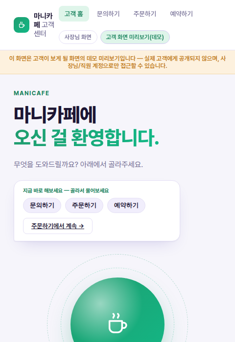
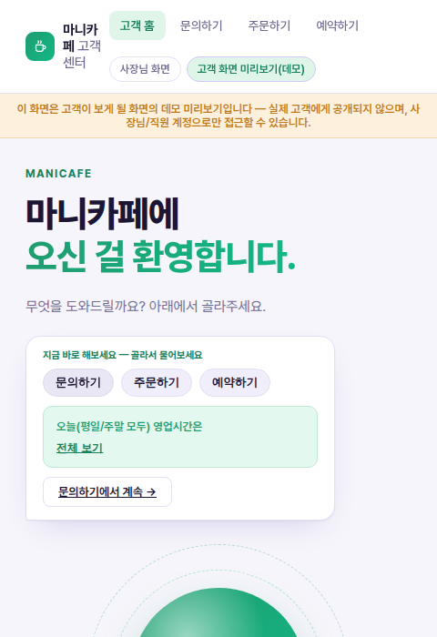
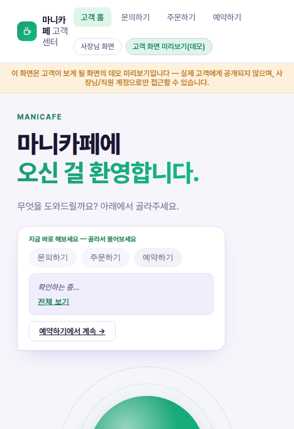
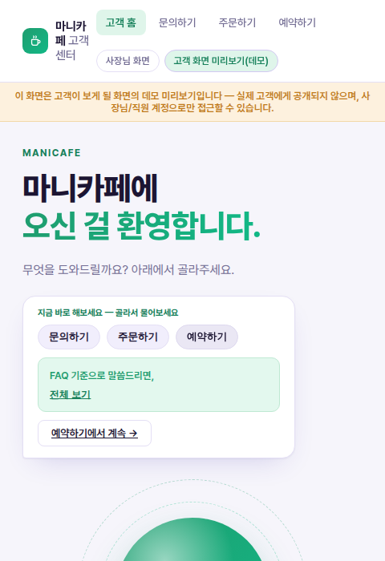
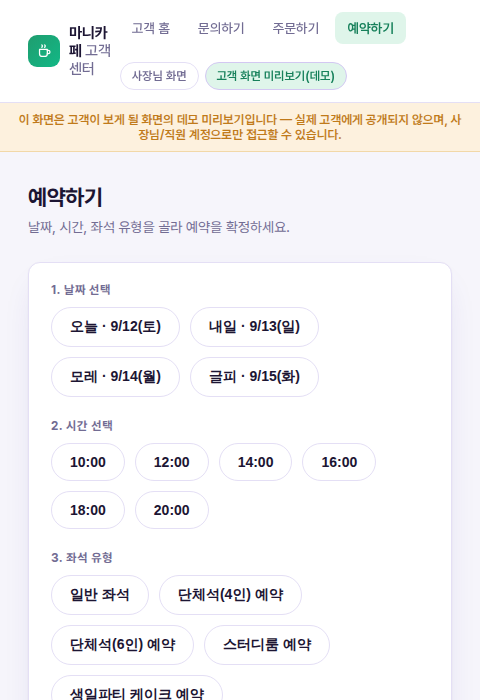

# 마니카페 고객 화면 — 할 수 있는 일 퀵 액션 위젯 스토리보드

**[260912_마니카페_2화면_스토리보드_주문데모.md](260912_마니카페_2화면_스토리보드_주문데모.md)에서 요청받은 형태 그대로, "고객 화면 미리보기"(`/customer`) 첫 화면에 실제로 구현했습니다.** 처음에는 주문 프롬프트 하나만 미리 채워진 한 줄 위젯이었는데, "고객이 할 수 있는 일을 화면에서 골라 쓸 수 있게 해달라"는 요청에 따라 **3개의 퀵 액션 칩**으로 넓혔습니다 — 문의하기·주문하기·예약하기 중 원하는 걸 클릭하면 coordinator가 그 자리에서 답하고, 바로 아래 바로가기 버튼이 그 액션에 맞는 정식 화면(`/customer/faq`·`/customer/order`·`/customer/reservation`)으로 자동으로 바뀝니다.

> 같은 방식으로 사장님 화면(`/home`)에도 구현한 문서: [260912_마니카페_사장님화면_한줄확인위젯.md](260912_마니카페_사장님화면_한줄확인위젯.md)

## 무엇을 바꿨나

| 구분 | 내용 |
|---|---|
| 화면 | `/customer`(고객 홈) 히어로 영역의 말풍선 |
| 코드 | `webapp/webapp_bff/templates/customer_home.html`, `webapp/webapp_bff/static/customer_home.js`(재작성) |
| 재사용 | `home.js`(사장님 화면)와 완전히 같은 패턴 — 칩 클릭 → 숨겨진 채팅 엔진으로 전송, `initChatWidget`/`renderCompactResult`/`.quick-chip` 재사용, 새 백엔드 로직 없음 |
| 퀵 액션 3종 | 문의하기 → `/customer/faq` · 주문하기 → `/customer/order` · 예약하기 → `/customer/reservation` |

> ✅ 실제 `http://localhost:19131` 컨테이너에도 반영해 재배포했습니다. git에는 아직 커밋되지 않았으니, 계속 유지하려면 별도로 커밋이 필요합니다.

---

## 스토리보드

### ① 퀵 액션 칩 — 고객이 할 수 있는 일 목록 (선택 준비)

- **액션 준비**: 손님이 `/customer`(고객 홈)에 들어오면 "지금 바로 해보세요 — 골라서 물어보세요" 아래 3개 칩(문의하기·주문하기·예약하기)이 보인다. 타이핑 없이 원하는 칩 하나를 고르면 된다.
- **결과 표시**: 아직 없음. 바로가기 버튼은 기본값으로 "주문하기에서 계속 →"가 떠 있다.
- **다음 액션**: 칩 하나를 클릭.

### ② 칩 클릭 직후 — 한 줄 대기 + 바로가기 즉시 전환 (액션 → 결과)

- **액션**: "문의하기" 칩을 클릭.
- **결과 표시**: "확인하는 중…" 대기 배지가 즉시 뜨고, **바로가기 버튼도 그 순간 "문의하기에서 계속 →"로 바뀐다** — 응답을 기다리지 않고도 손님은 이미 어디로 가게 될지 알 수 있다.
- **다음 액션**: coordinator의 응답을 기다린다.

### ③ 처리 결과 — 문의하기 (결과 표시)

- **결과 표시**: coordinator가 실제로 답한다: `"오늘(평일/주말 모두) 영업시간은"`(전체 보기로 전체 안내 문장을 펼쳐볼 수 있음).
- **다음 액션**: 다른 걸 더 물어보고 싶으면 다른 칩을 클릭하거나, "문의하기에서 계속 →"로 이동.

### ④ 다른 칩으로 전환 — "예약하기" (선택 변경)

- **액션**: 같은 자리에서 "예약하기" 칩을 클릭 — 방금 본 문의 결과 위에 그대로 덮어써진다.
- **결과 표시**: 바로가기 버튼이 다시 "예약하기에서 계속 →"로 바뀌고, "확인하는 중…" 상태로 전환.
- **다음 액션**: 응답을 기다린다.

### ⑤ 처리 결과 — 예약하기 (결과 표시)

- **결과 표시**: `"내일 오후 2시에 2명 예약할 수 있어?"` 질문에 coordinator가 답한다 — 이번 실행에서는 `"FAQ 기준으로 말씀드리면,"`으로 시작하는 안내 문장이 돌아왔다(예약 가능 여부를 바로 확정하기보다 정책을 먼저 안내하는 답변).
- **다음 액션**: 실제로 예약을 넣고 싶다면 **예약하기에서 계속 →** 버튼 클릭.

### ⑥ 바로가기 — 실제 예약 화면으로 이동 (다음 액션)

- **액션**: 바로가기 버튼 클릭 → `/customer/reservation`로 이동.
- **결과 표시**: 홈 위젯에서는 안내만 받았지만, 이 화면에서 실제로 날짜·시간·인원을 골라 예약을 생성할 수 있다.
- **다음 액션**: 손님이 예약 정보를 입력해 실제 예약을 완성한다.

---

## 사장님 쪽과 나란히 놓고 보면

| | 고객 화면(`/customer`) | 사장님 화면(`/home`) |
|---|---|---|
| 퀵 액션 개수 | 3개 (문의하기·주문하기·예약하기) | 5개 (매출·재고·예약·주문·문의) |
| 바로가기 목적지 | `/customer/faq`·`/customer/order`·`/customer/reservation` | `/dashboard`·`/inventory`·`/reservations`·`/orders`·`/support` |
| 공통 패턴 | 칩 클릭 → 숨겨진 채팅 엔진 → `renderCompactResult` 한 줄 결과 → 바로가기 버튼이 선택한 액션에 맞춰 동적으로 전환 | 〃 |

두 화면 모두 "고객/사장님이 할 수 있는 일을 화면에서 직접 골라 쓴다"는 같은 설계를 따르지만, 칩 개수와 목적지만 각 역할에 맞게 다릅니다.

## 구현 범위에 대한 참고

- coordinator의 응답 문구는 매 실행마다 달라질 수 있습니다(LLM 기반이라 결정론적이지 않음) — 예약 문의에 "FAQ 기준으로"라고 답한 것처럼, 매번 정확히 같은 형식으로 답하지 않습니다.
- 홈 위젯은 확인·안내용입니다 — 실제 주문 결제나 예약 생성처럼 되돌리기 어려운 액션을 완결하려면 여전히 손님이 정식 화면(`/customer/order`, `/customer/reservation`)으로 이동해 진행해야 합니다.
- 이전 버전(주문 프롬프트 1개 고정)의 스크린샷은 `assets/customer-home-order-widget/`에 남겨뒀습니다 — 이 문서는 그 다음 버전(퀵 액션 3개)을 기준으로 다시 썼습니다.
- pytest 87건은 이 변경 이후에도 그대로 통과합니다(백엔드 로직 변경 없음, 템플릿·정적 파일만 수정).
