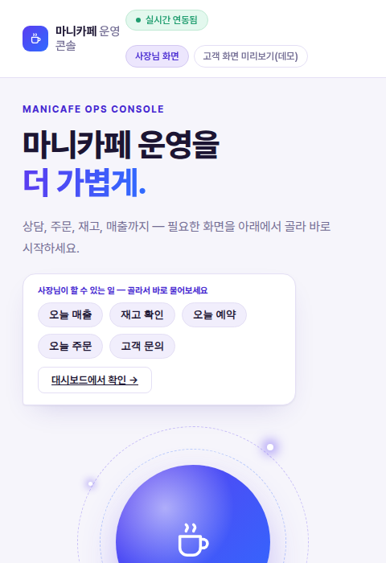
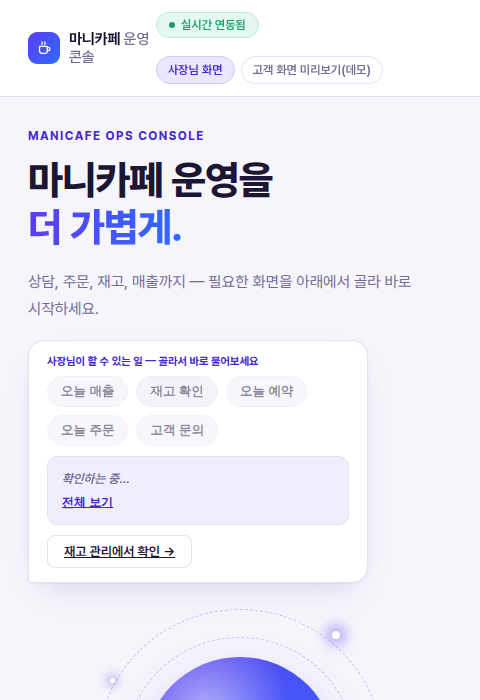
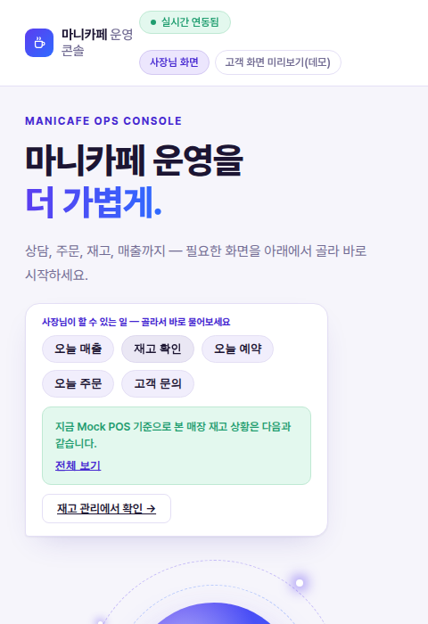
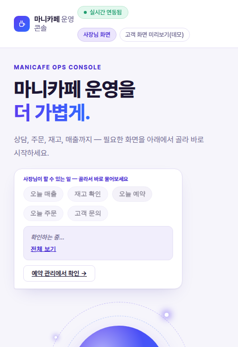
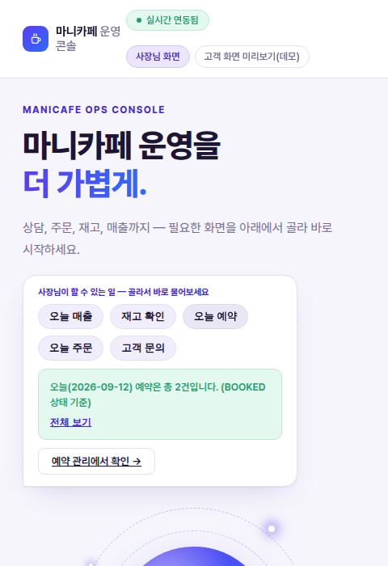
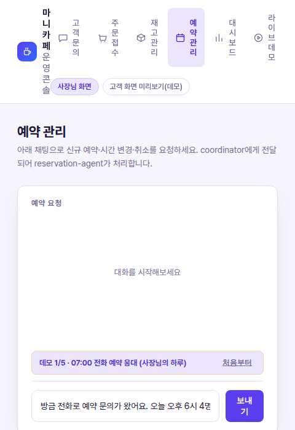

# 마니카페 사장님 화면 — 할 수 있는 일 퀵 액션 위젯 스토리보드

**[260912_마니카페_고객화면_한줄주문위젯.md](260912_마니카페_고객화면_한줄주문위젯.md)와 동일한 방식으로, 사장님 화면(`/home`)에 구현했습니다.** 처음에는 매출 질문 하나만 미리 채워진 한 줄 위젯이었는데, "사장님이 할 수 있는 일을 화면에서 골라 쓸 수 있게 해달라"는 요청에 따라 **5개의 퀵 액션 칩**으로 넓혔습니다 — 오늘 매출·재고·예약·주문·고객 문의 중 원하는 걸 클릭하면 coordinator가 그 자리에서 답하고, 바로 아래 바로가기 버튼이 그 답과 관련된 화면(대시보드/재고/예약/주문/문의)으로 자동으로 바뀝니다.

## 무엇을 바꿨나

| 구분 | 내용 |
|---|---|
| 화면 | `/home`(사장님 홈) 히어로 영역의 말풍선 |
| 코드 | `webapp/webapp_bff/templates/home.html`, `webapp/webapp_bff/static/home.js`(재작성) |
| 재사용 | `customer_order.js`의 "칩 클릭 → 숨겨진 채팅 엔진으로 전송" 기법을 그대로 가져옴. `initChatWidget`/`renderCompactResult`/`.quick-chip`(기존 `/support` 화면의 FAQ 칩과 같은 스타일)을 재사용 |
| 퀵 액션 5종 | 오늘 매출 → `/dashboard` · 재고 확인 → `/inventory` · 오늘 예약 → `/reservations` · 오늘 주문 → `/orders` · 고객 문의 → `/support` |

> ✅ 실제 `http://localhost:19131` 컨테이너에도 반영해 재배포했습니다. git에는 아직 커밋되지 않았으니, 계속 유지하려면 별도로 커밋이 필요합니다.

---

## 스토리보드

### ① 퀵 액션 칩 — 사장님이 할 수 있는 일 목록 (선택 준비)

- **액션 준비**: 사장님이 `/home`에 들어오면 "사장님이 할 수 있는 일 — 골라서 바로 물어보세요" 아래 5개 칩(오늘 매출·재고 확인·오늘 예약·오늘 주문·고객 문의)이 보인다. 타이핑 없이 원하는 칩 하나를 고르면 된다.
- **결과 표시**: 아직 없음. 바로가기 버튼은 기본값으로 "대시보드에서 확인 →"가 떠 있다.
- **다음 액션**: 칩 하나를 클릭.

### ② 칩 클릭 직후 — 한 줄 대기 + 바로가기 즉시 전환 (액션 → 결과)

- **액션**: "재고 확인" 칩을 클릭.
- **결과 표시**: "확인하는 중…" 대기 배지가 즉시 뜨고, **바로가기 버튼도 그 순간 "재고 관리에서 확인 →"로 바뀐다** — 응답을 기다리지 않고도 사장님은 이미 어디로 가게 될지 알 수 있다.
- **다음 액션**: coordinator의 응답을 기다린다.

### ③ 처리 결과 — 재고 확인 (결과 표시)

- **결과 표시**: coordinator가 실제 mock-pos 재고를 조회해 한 줄로 답한다: `"지금 Mock POS 기준으로 본 매장 재고 상황은 다음과 같습니다."`(전체 보기로 품목별 수량까지 펼쳐볼 수 있음).
- **다음 액션**: 다른 걸 더 물어보고 싶으면 다른 칩을 클릭하거나, "재고 관리에서 확인 →"로 이동.

### ④ 다른 칩으로 전환 — "오늘 예약" (선택 변경)

- **액션**: 같은 자리에서 "오늘 예약" 칩을 클릭 — 방금 본 재고 결과 위에 그대로 덮어써진다.
- **결과 표시**: 바로가기 버튼이 다시 "예약 관리에서 확인 →"로 바뀌고, "확인하는 중…" 상태로 전환.
- **다음 액션**: 응답을 기다린다.

### ⑤ 처리 결과 — 오늘 예약 (결과 표시)

- **결과 표시**: `"오늘(2026-09-12) 예약은 총 2건입니다. (BOOKED 상태 기준)"` — 실제 mock-pos 예약 데이터 기준 답변.
- **다음 액션**: **예약 관리에서 확인 →** 버튼 클릭.

### ⑥ 바로가기 — 실제 예약 화면으로 이동 (다음 액션)

- **액션**: 바로가기 버튼 클릭 → `/reservations`로 이동.
- **결과 표시**: 방금 홈 위젯이 답한 "2건"을 예약 관리 화면의 실제 표에서 다시 확인할 수 있다.
- **다음 액션**: 필요하면 이 화면에서 예약을 직접 생성·변경·취소한다.

---

## 손님 쪽과 나란히 놓고 보면

| | 고객 화면(`/customer`) | 사장님 화면(`/home`) |
|---|---|---|
| 선택 방식 | 미리 채워진 질문 1개 + 보내기 | 퀵 액션 칩 5개 중 선택 |
| 한 줄 결과 | 주문/결제 처리 상태(성공 시 주문 ID, 대기 시 승인 필요 안내) | 고른 액션에 따라 매출·재고·예약·주문·문의 현황 |
| 바로가기 버튼 | 항상 "주문확인 → `/customer/order`" 고정 | 고른 칩에 따라 대시보드/재고/예약/주문/문의로 **동적으로 전환** |
| 공통 패턴 | `initChatWidget`+`renderCompactResult`+숨겨진 채팅 엔진 재사용 | 〃 |

손님 쪽은 "결제까지 이어지는 하나의 흐름"이라 목적지가 항상 `/customer/order` 하나로 고정되지만, 사장님 쪽은 조회성 질문이 여러 종류라 **바로가기 버튼의 목적지 자체가 선택한 액션을 따라 바뀌는** 점이 다릅니다.

## 구현 범위에 대한 참고

- coordinator의 응답 문구는 매 실행마다 달라질 수 있습니다(LLM 기반이라 결정론적이지 않음) — 이 문서의 스크린샷은 실제로 한 번 실행해 얻은 결과입니다.
- 퀵 액션은 5개로 시작했지만 `home.js`의 `HOME_QUICK_ACTIONS` 배열에 항목만 추가하면 늘릴 수 있습니다(예: 홍보 문구 초안 요청, 마감 정산 요청 등).
- 이전 버전(매출 질문 1개 고정)의 스크린샷은 `assets/owner-home-sales-widget/`에 남겨뒀습니다 — 이 문서는 그 다음 버전(퀵 액션 5개)을 기준으로 다시 썼습니다.
- pytest 87건은 이 변경 이후에도 그대로 통과합니다(백엔드 로직 변경 없음, 템플릿·정적 파일만 수정).
